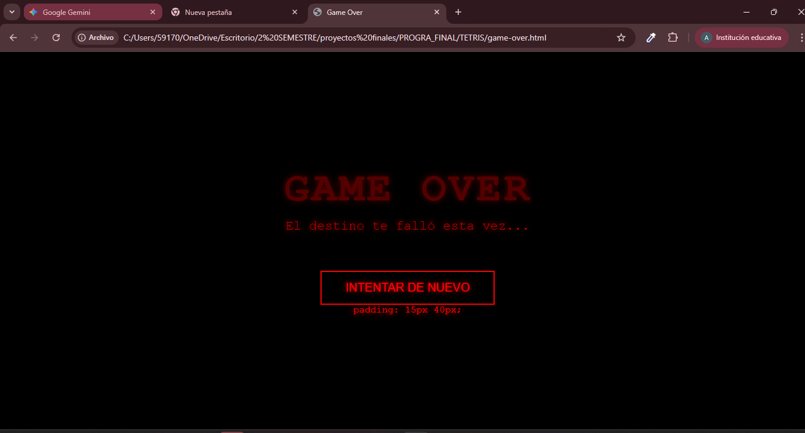

<div align= "center"> 

#  UNIVERSIDAD CATÓLICA BOLIVIANA “SAN PABLO” <br> CARRERA DE INGENIERÍA INDUSTRIAL SEDE SANTA CRUZ 


#  “PROYECTO FINAL” 

|  |  |
| :--- | :--- |
| **Asignatura:** | Programación I  |
| **Docente:** | Ing. Eddy Escalante Ustariz  |
| **Estudiante:** |Ortiz Pinckert Anahi <br> Aguilera Urgel Francisco Javier |
|||

 Santa Cruz, Bolivia <br> 
 2025 

</div>

<div align = "justify">

#
[ I. Introducción ](#i-introducción)<br>
[ II. Desarrollo del Proyecto](#ii-desarrollo-del-proyecto)<br>
[ III. Resultados](#iii-resultados)


## I. Introducción 
El presente informe documenta el desarrollo y la implementación del clásico videojuego Tetris, integrando una capa de interacción física a través del brazo robótico Dobot MG400.

### Objetivo General
El objetivo general de este proyecto es diseñar y programar una versión funcional del juego Tetris utilizando JavaScript y HTML5 Canvas, y establecer una comunicación bidireccional que permita al brazo robótico Dobot MG400 controlar o reflejar aspectos de la jugabilidad, demostrando la aplicación de los principios de la programación en un entorno dinámico y la integración de software con hardware.

### Importancia en la Materia de Programación
Este proyecto es fundamental en la materia porque:

* **Contribuye al Aprendizaje de Estructuras de Datos:** Requiere el manejo de matrices **(matrix.js)** para modelar el tablero de juego y la rotación de las piezas, que es un pilar de la programación.

* **Desarrollo de Lógica Orientada a Eventos:** El juego se basa en un bucle de juego continuo **(app.js con requestAnimationFrame)** y el manejo de eventos de usuario (teclado), reforzando la lógica de programación reactiva.

* **Implementación de Algoritmos Complejos:** El desarrollo de la lógica de colisión **(canMove)**, la fusión de piezas **(mergePiece)** y el algoritmo de eliminación de líneas **(clearLines)** exige la aplicación rigurosa de control de flujo y recursividad.

* **Integración de Sistemas:** La conexión del software (JavaScript) con un sistema físico (Dobot MG400) representa una demostración práctica de la programación de interfaces y la comunicación entre diferentes plataformas.

## II. Desarrollo del Proyecto
1. **Diseño del Videojuego**

**1.1. Descripción del Concepto**
Tetris es un juego de puzzle donde el jugador manipula piezas geométricas llamadas Tetriminos (compuestas por cuatro cuadrados) que caen desde la parte superior de un campo de juego rectangular. El objetivo es mover y rotar estas piezas para crear líneas horizontales sólidas sin huecos.

* **Objetivo:** Obtener la mayor puntuación posible completando líneas. El juego tiene una condición de victoria al alcanzar los 5000 puntos (WIN_SCORE).

* **Personajes/Piezas:** Se utilizan los 7 Tetriminos estándar (I, O, T, J, L, S, Z).

| Mecánica | Acción / Condición |
| :--- | :--- |  
| **Acciones del Jugador** | Mover pieza a la izquierda (ArrowLeft), a la derecha (ArrowRight), caída suave (ArrowDown), rotar (ArrowUp o Espacio), y caída fuerte (Enter). |
| **Condición para Ganar** | Alcanzar la puntuación predefinida de 5000 puntos (WIN_SCORE) |
| **Condición para Perder** | Una nueva pieza generada colisiona inmediatamente con bloques fijos en la zona de relleno (PADDING), impidiendo su movimiento.|

* **Descripción de los Niveles**<BR>
La dificultad en Tetris no se basa en un cambio de diseño de mapa, sino en la velocidad de caída de los Tetriminos

| Nivel| Puntuacion Requerida | velocidad de caida | Desafio |
| :--- | :--- | :--- | :--- |  
| **Nivel 1** | 0 puntos | 1000 ms (1 segundo) | Introducción, velocidad cómoda. |
| **Nivel 2** | 1000 puntos | 700 ms (0.7 segundos) | Incremento moderado de dificultad y ritmo. |
| **Nivel 3** | 3000 puntos | 400 ms (0.4 segundos) | Velocidad alta, requiere reacciones rápidas y planificación. |

**1.2. Herramientas Utilizadas**

| Tecnología |Rol en el Proyecto |
| :--- | :--- |  
|Lenguaje de Programación |"JavaScript (ES6): Utilizado para toda la lógica de juego (main.js, matrix.js) y el motor de renderizado (app.js)."
|Entorno de Desarrollo | Visual Studio Code: Editor principal para la codificación y gestión de archivos.
|Motor Gráfico/Renderizado |HTML5 Canvas API: Proporciona la superficie 2D para el dibujo de la cuadrícula y las piezas.
|Control de Versiones |"GitHub: Utilizado para la organización del trabajo, el control de versiones y la colaboración en equipo."
|Hardware de Integración |Dobot MG400: Brazo robótico utilizado para la interacción física (Sección 3.3).
|Software de Control | DobotStudio Pro: Software necesario para la configuración de la comunicación y la programación de las trayectorias del Dobot.|
|  |  |


**1.3. Integración con el Dobot MG400**
El Dobot MG400 fue configurado para reflejar la dificultad del juego, afectando la jugabilidad de la siguiente manera:

* Efecto en la Jugabilidad: El Dobot interactúa en el juego cuando el jugador sube de nivel
* Actuación (Control Físico con Coordenadas)
Pasos realizados para configurar el Dobot con DobotStudio Pro:
El teclado se fijó rígidamente a la mesa de trabajo para asegurar que las coordenadas fueran inmutables.<br>
Se utilizó el teach pendant o la interfaz de DobotStudio Pro para mover manualmente el efector final del brazo y registrar las coordenadas exactas de pulsación (X, Y, Z) para cada tecla de control del juego (Izquierda, Derecha, Rotar, Caída Suave).
<br>Estas coordenadas fijas se programaron dentro de las rutinas de movimiento del Dobot.

**1.4. Organización del Trabajo** 
El equipo de dos integrantes se dividió las tareas cubriendo las tres capas del proyecto: el juego, la inteligencia y la robótica.
| Integrante | Tareas Asignadas |
| :--- | :--- |  
| **Anahi Ortiz Pinckert** | Lógica y Funcionamiento del Juego: Desarrollo completo de la lógica de Tetris (clases Matrix y Piece, algoritmos de colisión, rotación, clearLines), y el motor de renderizado (app.js). |
| **Francisco Javier Aguilera Urgel** | Diseño, Estética e Integración del Dobot: Desarrollo de las interfaces HTML/CSS, el algoritmo de IA, , la configuración de coordenadas fijas del Dobot. |
||


## III. RESULTADOS
</div>

* **Capturas de pantalla del videojuego funcionando**
* Inicio del juego <br>


* Interfaz del juego <br>


* Fin del Juego <br>



* **Fotografía del Dobot MG400 interactuando con el videojuego**


<div align = "justify">

El proyecto se estructura en tres archivos JavaScript: matrix.js (estructura de datos), main.js (lógica de juego) y app.js (motor de dibujado y bucle principal).

### A. main.js - Lógica de Juego y Estado
1. Definición de las Piezas (Tetriminos)Las siete piezas se almacenan en el array PIECES, indexadas de 0 a 6. Cada pieza es un array de matrices que representan sus estados de rotación.
 El valor dentro de la matriz (1 a 7) corresponde al índice de la imagen/color del bloque.
 ```javascript
 JavaScriptconst PIECES = [
    // 0: T (Matriz valor 1)
    [
        [[0, 1, 0], [1, 1, 1], [0, 0, 0]], 
        [[0, 1, 0], [0, 1, 1], [0, 1, 0]], 
        [[0, 0, 0], [1, 1, 1], [0, 1, 0]], 
        [[0, 1, 0], [1, 1, 0], [0, 1, 0]]  
    ],
    // 1: Z (Matriz valor 2), 2: S (Matriz valor 3), ...
    // ...
    // 6: I (Matriz valor 7)
    [
        [[0, 0, 0, 0], [7, 7, 7, 7], [0, 0, 0, 0], [0, 0, 0, 0]],
        [[0, 7, 0, 0], [0, 7, 0, 0], [0, 7, 0, 0], [0, 7, 0, 0]]
    ]
 ];
    class Piece {
    constructor(shapeIndex) {
        this.shape = PIECES[shapeIndex]; 
        this.imageIndex = shapeIndex + 1; 
        this.rotation = 0; 
        this.matrix = this.shape[this.rotation]; 
        this.x = Math.floor((COLUMNS - this.matrix.length) / 2); // Centrado
        this.y = 0; // Inicio en el PADDING
    }
    }
```
2. Método de Detección de Colisiones (canMove)Este método es fundamental para la integridad del juego, verificando la validez de una posición propuesta antes de ejecutar el movimiento o la rotación.
```JavaScript
function canMove(piece, dx, dy, newMatrix = piece.matrix) {
    const pieceMatrix = newMatrix;
    const size = pieceMatrix.length;

    for (let r = 0; r < size; r++) {
        for (let c = 0; c < size; c++) {
            if (pieceMatrix[r][c] > 0) {
                // Mapear coordenadas de la pieza a coordenadas de la cuadrícula
                const gridX = piece.x + c + dx + 1;
                const gridY = piece.y + r + dy + PADDING;

                // 1. Verificar límites del tablero (paredes y suelo)
                if (gridX < 1 || gridX > COLUMNS || gridY < PADDING || gridY >= ROWS + PADDING) {
                    return false;
                }
                
                // 2. Verificar colisión con bloques fijos (valor > 0)
                if (gameGrid.getValue(gridY, gridX) > 0) {
                    return false;
                }
            }
        }
    }
    return true;
}
```
3. Método de Eliminación de Líneas y Puntuación (clearLines)Implementa la lógica de búsqueda y eliminación de líneas completas, gestionando el desplazamiento de filas superiores y la actualización del estado.
```JavaScript
function clearLines() {
    let linesCleared = 0;

    for (let r = ROWS + PADDING - 1; r >= PADDING; r--) {
        let isRowFull = true;
        for (let c = 1; c <= COLUMNS; c++) {
            if (gameGrid.getValue(r, c) === 0) {
                isRowFull = false;
                break; 
            }
        }

        if (isRowFull) {
            linesCleared++;
            
            // Desplazar las filas superiores hacia abajo
            for (let rr = r; rr >= PADDING; rr--) {
                for (let cc = 1; cc <= COLUMNS; cc++) {
                    let valueAbove = gameGrid.getValue(rr - 1, cc);
                    gameGrid.setValue(rr, cc, valueAbove);
                }
            }
            r++; // Repetir la verificación en la fila que ahora tiene nuevo contenido
        }
    }
    
    if (linesCleared > 0) {
        // Puntuación estándar: 100/300/500/800
        const points = [0, 100, 300, 500, 800];
        score += points[linesCleared];
        document.getElementById('score').innerText = score;
        
        checkLevelUp();
        checkWinCondition(); 
    }
}
```
### B. app.js - Renderizado y Bucle Principal
1. Bucle Principal del Juego (startGameLoop)Utiliza requestAnimationFrame para el renderizado suave y dropCounter para controlar la cadencia de la caída de la pieza según el nivel.
```JavaScript
let dropCounter = 0;
let lastTime = 0;
function startGameLoop(time = 0) {
    if (gameOver) {
      window.location.href = 'game-over.html'; 
      return; 
    }
    if (gameWin) {
      return; 
    }
    
    // Obtiene la velocidad según el nivel actual
    const dropInterval = DROP_SPEEDS[level] || DROP_SPEEDS[1]; 
    
    const deltaTime = time - lastTime;
    lastTime = time;

    // Control de la cadencia de caída
    dropCounter += deltaTime;
    if (dropCounter > dropInterval) {
        dropPiece(); // Lógica de main.js
        dropCounter = 0;
    }

    drawMap();
    requestAnimationFrame(startGameLoop); 
}
```
2. Método de Renderizado (drawMap)Dibuja el estado actual del tablero, incluyendo los bloques fijos y la pieza que cae. Se apoya en la carga asíncrona de imágenes (images).
```JavaScript
function drawMap() {
  ctx.clearRect(0, 0, canvas.width, canvas.height); 

  // 1. Dibujar el Tablero Fijo (gameGrid)
  for (let r = PADDING; r < BOARD_ROWS + PADDING; r++) {
    for (let c = 1; c <= BOARD_COLS; c++) {
      const value = gameGrid.getValue(r, c);
      
      const drawX = (c - 1) * cellSize; 
      const drawY = (r - PADDING) * cellSize;

      // Dibujar fondo y líneas de cuadrícula
      // ...
      
      if (value > 0) {
        // Dibujar la imagen del bloque (utiliza images[value - 1])
        const img = images[value - 1]; 
        if (img && img.complete) {
          ctx.drawImage(img, drawX, drawY, cellSize, cellSize);
        }
      }
    }
  }

  // 2. Dibujar la Pieza Actual (currentPiece)
  // ... (Lógica para iterar currentPiece.matrix y dibujarla sobre el tablero)
}
```
### C. matrix.js - Estructura de Datos
La clase Matrix proporciona una abstracción para manipular la cuadrícula 2D, simplificando la lógica de límites en main.js.
```JavaScript
class Matrix {
  rows;
  cols;
  data;

  constructor(rowsParam, colsParam, defaultValue = 1) {
    // Inicialización del array 2D
    // ...
  }

  isValidPosition(row, col) {
    return row >= 0 && row < this.rows && col >= 0 && col < this.cols;
  }

  setValue(row, col, value) {
    if (this.isValidPosition(row, col)) {
      this.data[row][col] = value;
    }
  }

  getValue(row, col) {
    return this.isValidPosition(row, col) ? this.data[row][col] : null;
  }
}

```
### Repositorio del juego


